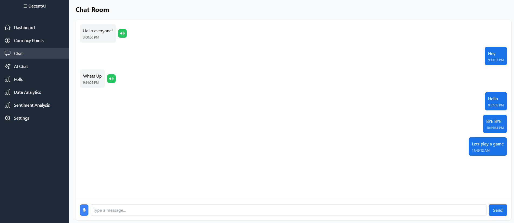
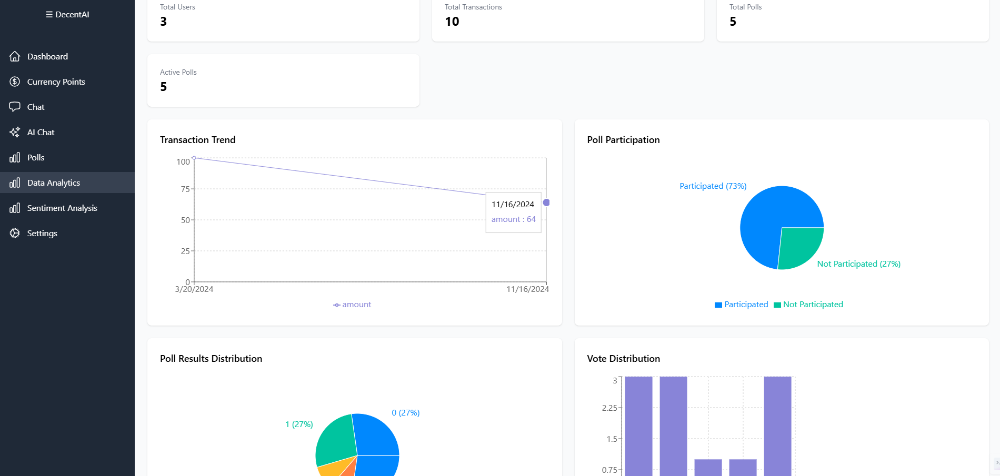
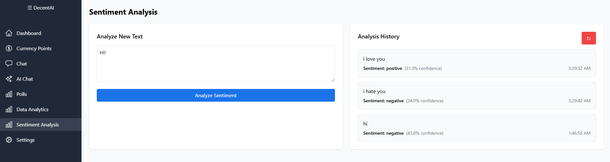
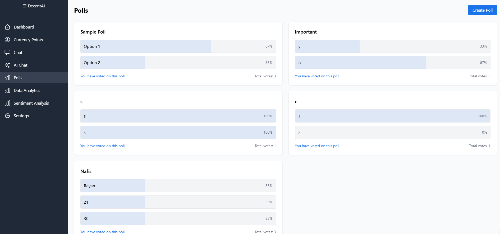

# DecentAI

A modern web application built with React and Python backend for AI-powered community engagement, featuring real-time sentiment analysis, interactive polls, and intelligent chat capabilities with comprehensive admin management tools.

## 📋 Project Overview

DecentAI is a comprehensive platform that leverages artificial intelligence to facilitate meaningful community interactions and policy discussions. The platform combines advanced NLP capabilities with modern web technologies to provide real-time sentiment analysis, interactive polling systems, AI-powered chat functionality, and robust administrative controls.

## Screenshots

Here are some screenshots of the app showcasing its key features and design:









## Screenshots

Here are some screenshots of the app showcasing its key features and design:


## 🚀 Core Features

### 🤖 AI-Powered Features
- **Intelligent Chat**: AI-powered conversations using Google's Gemini API
- **Real-time Sentiment Analysis**: Advanced NLP for text sentiment analysis
- **Overall Sentiment Summaries**: AI-generated comprehensive summaries of:
  - All chat conversations sentiment trends
  - Polls and voting pattern analysis
- **Content Analysis**: Automated content moderation and trend detection

### 📊 Community Engagement
- **Interactive Polls**: Create and participate in polls with real-time voting
- **Advanced Search**: Search functionality across all data tables
- **Data Analytics Dashboard**: Comprehensive analytics with user insights
- **Real-time Updates**: Live data synchronization across components

### 🔐 Security & Authentication
- **JWT-based Authentication**: Secure user authentication system
- **Protected Routes**: Role-based access control
- **Secure Data Storage**: MongoDB with proper data validation
- **Session Management**: Secure session handling with Flask

### � Administrative Controls
- **User Management**: Complete user lifecycle management with cascading deletes
- **Admin Request System**: Process admin access requests with approval/rejection workflow
- **Content Moderation**: Delete individual admin requests, polls, and chat messages
- **System Cleanup**: Clear all chat messages and manage platform content
- **Audit Trail**: Track all administrative actions and changes

### 🎨 Modern UI/UX
- **Responsive Design**: Mobile-first approach with Tailwind CSS
- **Custom Modal System**: Professional confirmation dialogs replacing browser alerts
- **Enhanced Notifications**: Color-coded success (green) and error (red) messages
- **Accessibility**: WCAG compliant design with proper form attributes
- **Dark/Light Theme Support**: Modern design system

## 🛠️ Technology Stack

### Frontend
- **React 18** - Modern JavaScript library for building user interfaces
- **Tailwind CSS** - Utility-first CSS framework
- **React Router** - Declarative routing for React
- **Recharts** - Composable charting library
- **HeroIcons** - Beautiful hand-crafted SVG icons
- **Custom Modal System** - Professional confirmation dialogs
- **Google Generative AI** - AI-powered content generation

### Backend
- **Python Flask** - Lightweight WSGI web application framework
- **MongoDB** - NoSQL database for flexible data storage
- **JWT Authentication** - JSON Web Tokens for secure authentication
- **CORS** - Cross-Origin Resource Sharing support
- **Wink NLP** - Natural Language Processing library

### DevOps & Tools
- **npm/yarn** - Package management
- **Git** - Version control
- **ESLint** - Code linting
- **Virtual Environment** - Python dependency isolation

## 🚀 Key Features Implemented

### 🔍 Advanced Search Functionality
- **Polls Search**: Search through poll titles and options with real-time filtering
- **Data Analytics Search**: Search across users, chats, and transactions tables
- **Smart Filtering**: Case-insensitive search with instant results
- **No Results Handling**: User-friendly messages when no matches found

### 📊 Sentiment Analysis System
- **Individual Text Analysis**: Real-time sentiment analysis using Wink NLP
- **AI-Powered Summaries**: Gemini API integration for comprehensive sentiment analysis
- **Chat Sentiment Summary**: Overall sentiment analysis of all chat conversations
- **Polls Sentiment Summary**: Voting pattern and sentiment analysis of all polls
- **Analysis History**: Persistent storage and display of analysis results

### 🗳️ Interactive Polling System
- **Poll Creation**: Create polls with multiple options
- **Real-time Voting**: Live voting with duplicate prevention
- **Vote Tracking**: Secure voter tracking system
- **Results Visualization**: Dynamic percentage bars and vote counts
- **Search Integration**: Search through polls and their options

### 👑 Administrative Management System
- **User Lifecycle Management**: Complete user management with cascading data deletion
- **Admin Request Processing**: Approve, reject, or delete individual admin requests
- **Content Moderation**: Delete polls, users, and manage platform content
- **Chat Management**: Clear all chat messages for system maintenance
- **Audit & Control**: Comprehensive admin tools for platform management

### 🎨 Custom Modal & Notification System
- **Professional Modals**: Custom confirmation dialogs replacing browser alerts
- **Color-Coded Notifications**: Green for success, red for errors
- **Accessibility Compliance**: WCAG compliant with proper form attributes
- **Enhanced UX**: Better user experience with modern dialog design
- **Keyboard Navigation**: Full keyboard support and screen reader compatibility

### 🛡️ Data Integrity & Security
- **Cascading Deletes**: Automatic cleanup of all related user data
- **Secure Deletions**: Confirmation dialogs prevent accidental data loss
- **Audit Trail**: Track all administrative actions
- **Data Validation**: Comprehensive input validation and sanitization

### 💬 AI Chat System
- **Gemini AI Integration**: Powered by Google's Gemini 1.5 Flash model
- **Contextual Conversations**: Maintains conversation history
- **Voice Input**: Speech recognition for hands-free interaction
- **Text-to-Speech**: Audio output for chat responses
- **Real-time Responses**: Instant AI-generated responses

### 📈 Data Analytics Dashboard
- **Comprehensive Overview**: Users, chats, polls, and transactions analytics
- **Interactive Charts**: Visual data representation using Recharts
- **Search Integration**: Search across all data tables
- **Real-time Updates**: Live data synchronization
- **Export Ready**: Structured data for further analysis

### 🔐 Authentication & Security
- **JWT Authentication**: Secure token-based authentication
- **Protected Routes**: Role-based access control
- **Session Management**: Secure session handling
- **Data Validation**: Input validation and sanitization
- **MongoDB Security**: Secure database connections

### 🎨 User Interface
- **Modern Design**: Clean, intuitive interface with Tailwind CSS
- **Responsive Layout**: Mobile-first design approach
- **Interactive Elements**: Smooth animations and hover effects
- **Loading States**: User feedback during data operations
- **Error Handling**: Comprehensive error messages and recovery options

## 📋 Prerequisites

- **Node.js** (v18 or higher)
- **Python** 3.8+
- **MongoDB** (local installation or cloud service like MongoDB Atlas)
- **npm** or **yarn** package manager
- **Git** for version control

## 🛠️ Installation & Setup

### 1. Clone the Repository
```bash
git clone https://github.com/NafisRayan/DecentAI.git
cd DecentAI
```

### 2. Frontend Setup
```bash
# Install frontend dependencies
npm install

# Start development server
npm start
```
The frontend will be available at `http://localhost:3000`

### 3. Backend Setup

#### Create Python Virtual Environment
```powershell
# Navigate to Backend directory
cd Backend

# Create virtual environment
python -m venv venv

# Activate virtual environment
venv\Scripts\Activate.ps1
```

#### Install Backend Dependencies
```powershell
# Install Python packages
pip install -r requirements.txt
```

#### Start Backend Server

```
cd .\Backend\;venv\Scripts\Activate.ps1;python app.py
```

#### MongoDB Setup
- **Option A: Local MongoDB**
  - Install MongoDB Community Server
  - Start MongoDB service
  - Default connection: `mongodb://localhost:27017`

- **Option B: MongoDB Atlas (Cloud)**
  - Create account at mongodb.com
  - Create a cluster
  - Get connection string and update in `app.py`

#### Environment Configuration
Create a `.env` file in the Backend directory (optional):
```env
MONGODB_URI=mongodb://localhost:27017
JWT_SECRET=your-secret-key
```

### 4. Start the Backend Server
```powershell
# From Backend directory with virtual environment activated
python app.py
```
The backend will run on `http://localhost:5000`

## 🚀 Running the Application

1. **Start Backend First:**
   ```bash
   cd Backend
   venv\Scripts\Activate.ps1
   python app.py
   ```

2. **Start Frontend:**
   ```bash
   # In a new terminal
   npm start
   ```

3. **Access the Application:**
   - Frontend: http://localhost:3000
   - Backend API: http://localhost:5000

## 📁 Project Structure

```
DecentAI/
├── public/                 # Static assets
│   ├── dai1.png           # Screenshots
│   ├── dai2.png
│   ├── dai3.png
│   ├── dai4.png
│   └── favicon.ico
├── src/                   # Frontend React application
│   ├── components/        # Reusable UI components
│   │   ├── Layout/       # Layout components
│   │   │   ├── Layout.jsx
│   │   │   ├── Sidebar.jsx
│   │   └── ui/           # UI components
│   │       └── Modal.jsx # Custom modal system
│   ├── contexts/         # React contexts
│   │   ├── AuthContext.jsx
│   │   └── model_artifacts.json
│   ├── pages/            # Main application pages
│   │   ├── AIChat.jsx    # AI chat interface
│   │   ├── Chat.jsx      # Chat functionality
│   │   ├── Dashboard.jsx # Main dashboard
│   │   ├── DataAnalytics.jsx # Analytics dashboard
│   │   ├── LoginRegister.jsx # Authentication
│   │   ├── Polls.jsx     # Polling system
│   │   ├── SentimentAnalysis.jsx # Sentiment analysis
│   │   └── UserSettings.jsx # User settings & admin panel
│   ├── App.jsx           # Main app component
│   ├── index.js          # App entry point
│   └── setupTests.js     # Test setup
├── Backend/              # Python Flask backend
│   ├── app.py           # Main Flask application with admin endpoints
│   ├── requirements.txt # Python dependencies
│   ├── test_backend.py  # Backend tests
│   └── venv/            # Virtual environment
├── package.json         # Node.js dependencies
├── tailwind.config.js   # Tailwind CSS configuration
└── README.md           # Project documentation
```

## 🆕 Recent Updates & Improvements

### v2.0.0 - Enhanced Admin & Accessibility Features

#### 🎨 UI/UX Enhancements
- **Custom Modal System**: Replaced browser `window.confirm()` with professional, accessible modal dialogs
- **Enhanced Notifications**: Color-coded success (green) and error (red) messages throughout the app
- **Accessibility Compliance**: Fixed form attributes, added proper ARIA labels, and improved keyboard navigation
- **Responsive Design**: Improved mobile experience and cross-device compatibility

#### � Administrative Features
- **Cascading User Deletion**: Complete data cleanup when deleting users (removes transactions, chats, polls, admin requests, analysis history)
- **Individual Admin Request Management**: Delete specific admin requests with confirmation dialogs
- **Chat Management**: Admin-only feature to clear all chat messages for system maintenance
- **Enhanced Admin Panel**: Improved user management interface with better search and filtering

#### 🔧 Backend Improvements
- **New API Endpoints**: Added comprehensive admin operations endpoints
- **Data Integrity**: Cascading delete operations ensure no orphaned data
- **Error Handling**: Enhanced error responses and validation
- **Security**: Improved data validation and secure deletion operations

#### 📱 Frontend Enhancements
- **Modal Component Library**: Reusable modal system for consistent user interactions
- **State Management**: Improved state handling for admin operations
- **Real-time Updates**: Automatic data refresh after admin operations
- **Loading States**: Better user feedback during operations

### Frontend Technologies
- **[React 18](https://reactjs.org/)** - Modern JavaScript library for building user interfaces
- **[Tailwind CSS](https://tailwindcss.com/)** - Utility-first CSS framework for rapid UI development
- **[React Router](https://reactrouter.com/)** - Declarative routing for React applications
- **[Recharts](https://recharts.org/)** - Composable charting library built on React components
- **[HeroIcons](https://heroicons.com/)** - Beautiful hand-crafted SVG icons
- **[Google Generative AI](https://ai.google.dev/)** - AI-powered content generation and analysis

### Backend Technologies
- **[Python Flask](https://flask.palletsprojects.com/)** - Lightweight WSGI web application framework
- **[MongoDB](https://www.mongodb.com/)** - NoSQL database for flexible data storage
- **[PyMongo](https://pymongo.readthedocs.io/)** - Python driver for MongoDB
- **[JWT](https://jwt.io/)** - JSON Web Tokens for secure authentication
- **[Flask-CORS](https://flask-cors.readthedocs.io/)** - Cross-Origin Resource Sharing for Flask
- **[Wink NLP](https://winkjs.org/wink-nlp/)** - Natural Language Processing library

### Development Tools
- **[npm](https://www.npmjs.com/)** - Package manager for Node.js
- **[Git](https://git-scm.com/)** - Distributed version control system
- **[ESLint](https://eslint.org/)** - Tool for identifying and reporting patterns in ECMAScript/JavaScript code
- **[Python venv](https://docs.python.org/3/library/venv.html)** - Virtual environment for Python

## 🔌 API Endpoints

### Authentication
- `POST /auth/register` - User registration
- `POST /auth/login` - User login
- `POST /auth/logout` - User logout

### Data Management
- `GET /users` - Get all users
- `GET /chats` - Get all chat messages
- `POST /chats` - Send chat message
- `GET /polls` - Get all polls
- `POST /polls` - Create new poll
- `POST /polls/<poll_id>/vote` - Vote on a poll
- `GET /transactions` - Get all transactions

### Administrative Operations
- `GET /admin-requests` - Get all admin requests
- `POST /admin-requests` - Submit admin request
- `POST /admin-requests/<request_id>/approve` - Approve admin request
- `POST /admin-requests/<request_id>/reject` - Reject admin request
- `DELETE /admin/delete-admin-request/<request_id>` - Delete admin request
- `DELETE /admin/delete-user/<user_id>` - Delete user (with cascading cleanup)
- `DELETE /admin/delete-poll/<poll_id>` - Delete poll
- `DELETE /admin/clear-chats` - Clear all chat messages

### AI & Analysis
- `GET /analysis-history` - Get sentiment analysis history
- `POST /analysis-history` - Save analysis result
- `DELETE /analysis-history` - Clear analysis history

## 🚀 Deployment

### Frontend Deployment
```bash
# Build the production version
npm run build

# The build artifacts will be stored in the `build/` directory
```

### Backend Deployment
```bash
# Set environment variables
export MONGODB_URI="your-mongodb-connection-string"
export JWT_SECRET="your-jwt-secret"

# Run with production WSGI server
gunicorn --bind 0.0.0.0:5000 app:app
```


## 🙏 Acknowledgments

- **Google Generative AI** for providing powerful AI capabilities
- **The React and Flask communities** for excellent documentation and support
- **MongoDB** for reliable database solutions and comprehensive documentation
- **Tailwind CSS** for beautiful, responsive design utilities
- **HeroIcons** for consistent and professional iconography
- **Open source contributors** for accessibility tools and best practices
- **Web accessibility community** for WCAG guidelines and inclusive design principles

---

## 📈 Version History

### v2.0.0 (Latest)
- ✅ **Custom Modal System**: Professional confirmation dialogs
- ✅ **Enhanced Admin Panel**: Complete user and content management
- ✅ **Cascading Deletes**: Comprehensive data cleanup operations
- ✅ **Accessibility Compliance**: WCAG compliant form attributes
- ✅ **Color-coded Notifications**: Green success, red error messages
- ✅ **Admin Request Management**: Individual request deletion
- ✅ **Chat Management**: Admin-only chat clearing functionality

### v1.0.0
- ✅ Initial release with AI chat, sentiment analysis, and polling
- ✅ Basic user authentication and dashboard
- ✅ Real-time data visualization and analytics

---

**DecentAI** - Empowering communities through AI-driven engagement, intelligent analysis, and comprehensive administrative controls.
